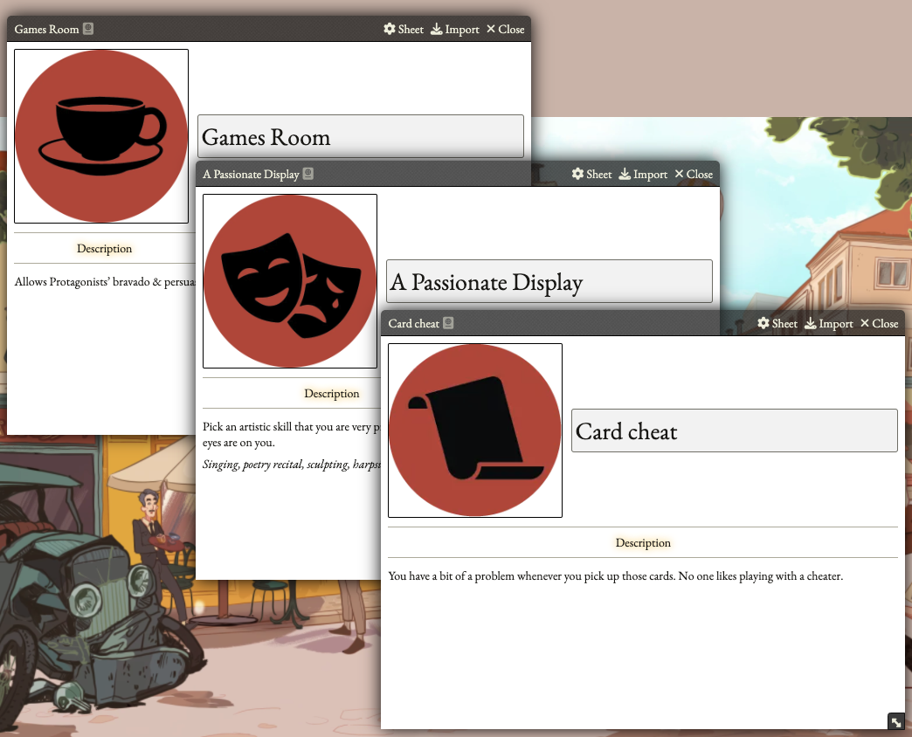
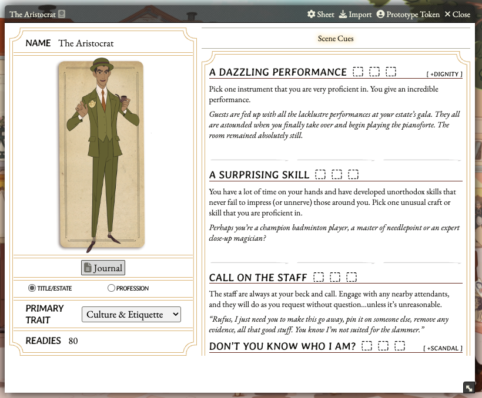
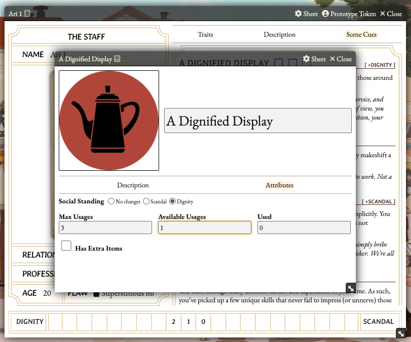
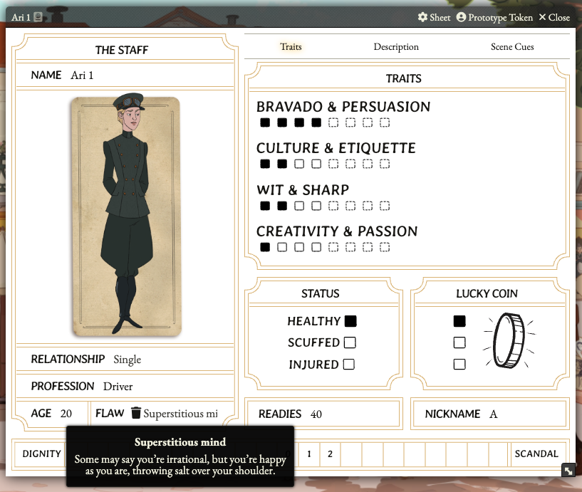
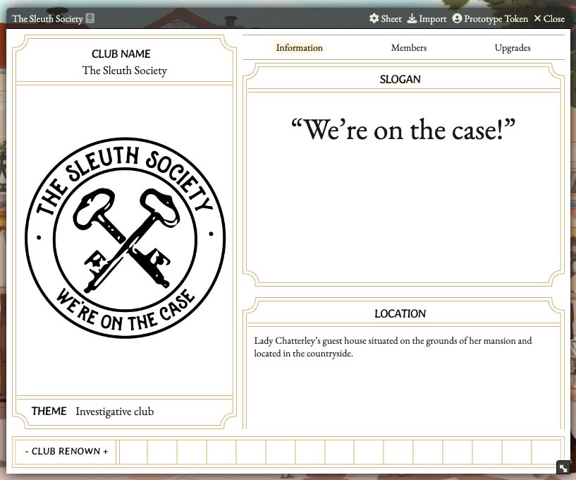
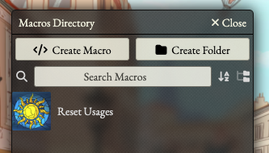

# Flabbergasted System

This is the official Foundry System for the "Flabbergasted" RPG, created by [The Wanderer's Tome](https://www.wanderers-tome.com/)!

The system does not contain any data for the game. You can create that, following the guide below.

Or you can purchase the [premium module](https://hodpub.com/product/flabbergasted/), which contains all the core rules, converted to Foundry to give you the best experience possible!

## How to use the system?
The system has three main "item" types: scene cues, flaws and social club upgrades.

For a full usage, you will need to use a special actor type called "Archetype".

Starting create the scene cues. After you have them ready, you can create the Archetype. Drag and drop the scene cues into the Archetype to link them.

With that ready, you can start to create the Characters. Drag and Drop the Archetype to the character sheet to automatically link all the Archetype information into the Character.

Right click a scene cue and edit that to increase the available usages. Leave the used field as zero.

Clicking on the scene cue will mark a usage and show the scene cue name and description into the chat. When the scene cue changes the social standing, the system will do that automatically.

To increate the traits, status or luck coin, use "Shift + Click". To reduce the value, use "Alt/Options + Click". Clicking on the trait will make a roll for the trait clicked, showing the result on the chat.

If necessary, click on the "Scandal" or "Dignity" button to increase the value.

Drag and drop the flaw to the character sheet. Hovering the mouse on the flaw will show a tooltip with their description.

You can click on the Nickname, if you have one, to mark it as used for the session.

Create the social club and after configure their information, drag and drop it to the character sheet to link them to the club.

You can create the club upgrades as you need them. Drag and drop the club upgrades to the Social Club sheet. It will validate the minimum renown level and the required readies, subtracting the readies automatically.

Some club upgrades influences the character sheet, like the Game Room, that allows Protagonists’ bravado & persuasion to be raised above 4 to a maximum cap of 8. When you have the social club linked to the character sheets, these kind of upgrades will load automatically.

The GM will have a special macro called "Reset day", which automatically resets all the usages for the Scene Cues and Social Club Upgrades.

